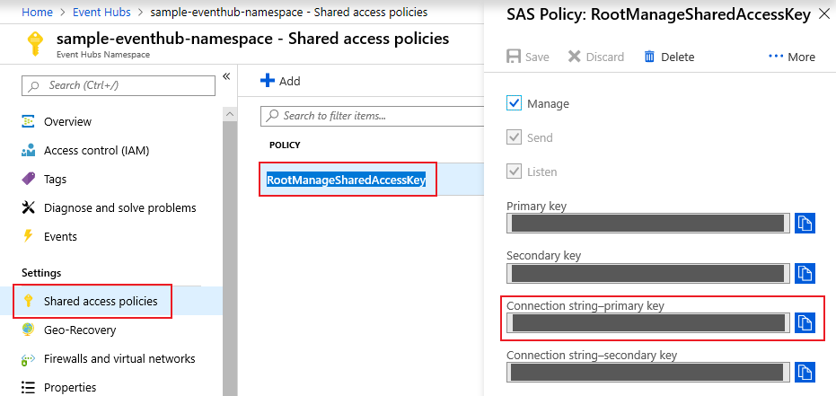
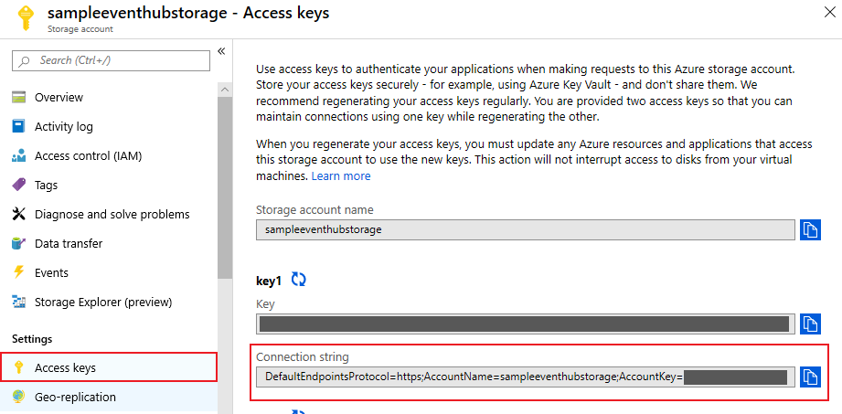

# KEDA and Azure Functions with Azure Event Hub Sample
This sample goes through the basics of creating an Azure Function that triggers with a new Event Hub message. The function can then be deployed to Kubernetes with KEDA for event driven activation and scale. 


## Pre-requisites
- [Azure Function Core Tools v2](https://github.com/azure/azure-functions-core-tools#installing). Makes sure the version is greater than: 2.7.1149
- An Azure Subscription (to host the event hub). A free account works great - https://azure.com/free
- Kubernetes cluster (can be [AKS](https://docs.microsoft.com/en-us/azure/aks/kubernetes-walkthrough-portal), GKE, EKS, OpenShift etc.) and [`kubectl`](https://kubernetes.io/docs/tasks/tools/install-kubectl/) pointing to your Kubernetes cluster (for [AKS](https://docs.microsoft.com/en-us/azure/aks/kubernetes-walkthrough#connect-to-the-cluster)). NOTE: If you want to use KEDA with Azure Virtual Nodes, be sure to enable Virtual Nodes at create.
- Docker and a Docker registry 

## Tutorial
**1. Create a new directory for the function app**
  ```
  mkdir sample-eventhub
  cd sample-eventhub
  ```

**2. Initialize the directory for functions**
  ```
  func init . --docker
  ```
  Select **node** and **Javascript**

**3. Add a new Event Hub triggered function**
  ```
  func new
  ```
  Select **Azure Event Hub trigger**. Leave the default of `EventHubTrigger` as the name.
  
**4. Create an Azure Event Hub**

  We will create an Azure Event Hub using the [Azure portal](https://docs.microsoft.com/en-us/azure/event-hubs/event-hubs-create), but you can also create an Event Hub using [Azure CLI](https://docs.microsoft.com/en-us/azure/event-hubs/event-hubs-quickstart-cli), [Powershell](https://docs.microsoft.com/en-us/azure/event-hubs/event-hubs-quickstart-powershell), or an [Azure Resource Manager template](https://docs.microsoft.com/en-us/azure/event-hubs/event-hubs-resource-manager-namespace-event-hub). 
 
  Go to Event Hubs in the [Azure Portal]() and click on new. Fill in a name for your Event Hub namespace, your Azure subscription, your resource group, and which location you'd like your Event Hub to be deployed to. Click `Create` and wait for your Event Hub to be deployed. 
  
  
  
  
  Once deployed, go to your new namespace and click on `+ Event Hub` to create a new Event Hub. Write "sample-eventhub" under name and click `Create`. 
  
  
  
  
 **5. Create an Azure Storage Account**
 
  Functions is built on top of an __event processor host (EPH)__, an intelligent consumer agent that simplifies the management of checkpointing, leasing, and parallel event readers. To use the EPH, you must have an Azure Storage Account set up to store checkpointing and leasing information. As of now, the Event Hub scaler **only** supports reading from Blob Storage.
  
  Click `+ Add` in Storage accounts. Fill in the same subscription and resource group that you used before, and choose a storage account name and a location. Everything else can be left as their default values. Click `Review + Create` and then `Create` again.
  
  
  
  
  
 **6. Getting connection strings for Event Hub and Storage Accounts**
 
  To [get the connection string of your Event Hub](https://docs.microsoft.com/en-us/azure/event-hubs/event-hubs-get-connection-string), go to your Event Hub namespace in the Azure Portal, click on `Shared access policies` under Settings. From there, click on `RootManageSharedAccessKey` and copy the value under `Connection string--primary key`. 
  
  
  
 Before setting this value to the side, add `EntityPath=sample-eventhub` at the end, or `EntityPath=<your-event-hub-name>` if you chose a different name for your Event Hub. Your Event Hub connection string should look like this now:
  ```
Endpoint=sb://<your-eventhub-namespace>.servicebus.windows.net/;SharedAccessKeyName=RootManageSharedAccessKey;SharedAccessKey=secretKey123;EntityPath=sample-eventhub
  ```
  
  To get the connection string of your Storage Account, go to your Storage Account and click on `Access keys` under Settings. From there, copy the connection string under **key1** and set this to the side too.
  
  
  
**7. Updating function metadata with Event Hub and Storage account information**

  Once you have both connection strings, open `local.settings.json` which has the local debug connection string settings. Replace the `{AzureWebJobsStorage}` with the storage connection string value. Add `"EventHub": <your event hub connection string>` underneath `AzureWebJobsStorage`. Your `local.settings.json` should now look like the following:

**local.settings.json**
 ```json
 {
  "IsEncrypted": false,
  "Values": {
    "FUNCTIONS_WORKER_RUNTIME": "node",
    "AzureWebJobsStorage": "DefaultEndpointsProtocol=https;AccountName=yourStorageAccountName;AccountKey=yourStorageAccountKey;EndpointSuffix=core.windows.net",
    "EventHub": "Endpoint=sb://your-eventhub-namespace.servicebus.windows.net/;SharedAccessKeyName=RootManageSharedAccessKey;SharedAccessKey=secretKey123;EntityPath=sample-eventhub"
  }
}
 ```
 
 Open the `EventHubTrigger/function.json` file and set the `connection` setting value to `EventHub`. Add a `storageConnection` setting under and set it to `AzureWebJobsStorage`. This tells the function to pull the connection strings from the `EventHub` key and `AzureWebJobsStorage` key we set above. Set `eventHubName` to `sample-eventhub` so your Function knows which event hub to consume messages from in your namespace, and set `dataType` to `string` since we will be sending string messages to our Event Hub.
 
 **function.json**
 ```json
 {
  "bindings": [
    {
      "type": "eventHubTrigger",
      "name": "eventHubMessages",
      "direction": "in",
      "eventHubName": "sample-eventhub",
      "connection": "EventHub",
      "storageConnection": "AzureWebJobsStorage",
      "cardinality": "many",
      "consumerGroup": "$Default"
    }
  ]
}
 ```
 
 **8. Enabling and adding event hub extensions on function runtime**
 
 Replace the `host.json` file with the following. This [pulls in the extensions to the function runtime](https://docs.microsoft.com/en-us/azure/azure-functions/functions-bindings-register#local-development-with-azure-functions-core-tools-and-extension-bundles), and adds extensions such as `batchCheckpointFrequency`, which creates a checkpoint for every 16 messages.
 
 **host.json**
 ```json
 {
    "version": "2.0",
    "extensions": {
        "eventHubs": {
            "batchCheckpointFrequency": 16,
            "maxBatchSize": 16,
            "prefetchCount": 32
        }
    },
    "extensionBundle": {
        "id": "Microsoft.Azure.Functions.ExtensionBundle",
        "version": "[1.*, 2.0.0)"
    }
}
 ```
 
 **9. Debug and test the function locally (optional)**
  will insert more later on>

**10. Install KEDA**
```
func kubernetes install --namespace keda
```

To confirm that KEDA has successfully installed you can run the following command and should see the following CRD.
```
kubectl get customresourcedefinition
NAME                        AGE
scaledobjects.keda.k8s.io   2h 
```

**11a. Deploy Function app to KEDA (standard)**
You can then deploy your function to Kubernetes. If you want to deploy so that the function may run on Virtual Nodes, [follow 11b](#deploy-virtual-nodes). 
```
func kubernetes deploy --name sample-eventhub --registry <docker-user-id>
```

**[11b. Deploy Function app to KEDA (Virtual Nodes)](#deploy-virtual-nodes)**

To deploy your function Kubernetes with Azure Virtual Nodes, you need to modify the details of the deployment to allow the selection of virtual nodes.

Generate a deployment yaml for the function.
```
func kubernetes deploy --name sample-eventhub --registry <docker-user-id> --javascript --dry-run > deploy.yaml
```

Open the created `deploy.yaml`. To tolerate scheduling onto any nodes, including virtual, modify the deployment in the file.
```yaml
    spec:
      containers:
      - name: sample-eventhub
        image: <your-docker-user-id>/sample-eventhub
        env:
        - name: AzureFunctionsJobHost__functions__0
          value: EventHubTrigger
        envFrom:
        - secretRef:
            name: sample-eventhub
```

Build and deploy the container image, and apply the deployment to your cluster.

```
docker build -t <your-docker-user-id>/sample-eventhub .
docker push <your-docker-user-id>/sample-eventhub

kubectl apply -f deploy.yaml
```

**12. Send messages to your event hub and validate the function app scales with KEDA**

To check if your deployment was successful, run `kubectl get deploy`. You should see the following: 

```
NAME              DESIRED   CURRENT   UP-TO-DATE   AVAILABLE   
sample-eventhub   0         0         0            0          
```

Initially after deploy and with an eventhub with 0 unprocessed messages, you should see 0 pods. When you send messages to the EventHub, KEDA will detect the events and add a pod. By default the polling interval set is 30 seconds on the `ScaledObject` resource, so it may take up to 30 seconds for the events to be detected and activate your function. This can be [adjusted on the `ScaledObject` resource](https://github.com/kedacore/keda/wiki/ScaledObject-spec). To check whether or not you have pods, run the following:

```
kubectl get pods -w
```

The events sent to the Event Hub will be consumed by your Functions app running in the Kubernetes pods. You can validate your Functions app consumed these events by using `kubectl logs <pod-name>`. If enough events are sent to the function then KEDA will autoscale. After all events are consumed and the cooldown period has elapsed (default 300 seconds), the last pod should scale back down to zero.


## Cleaning Up Resources

**Delete the function deployment**
```
kubectl delete -f deploy.yaml
```

**Uninstall KEDA**
```
func kubernetes remove --namespace keda
```
